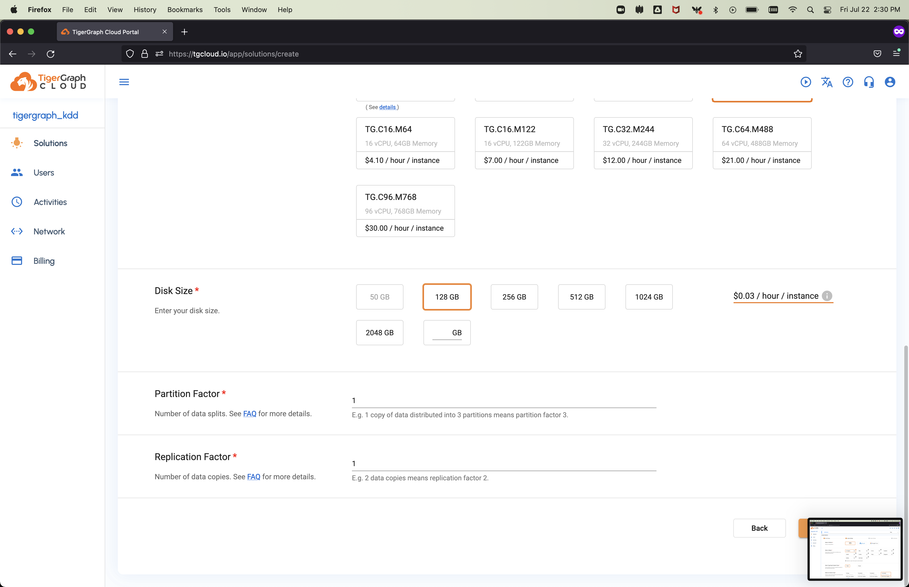
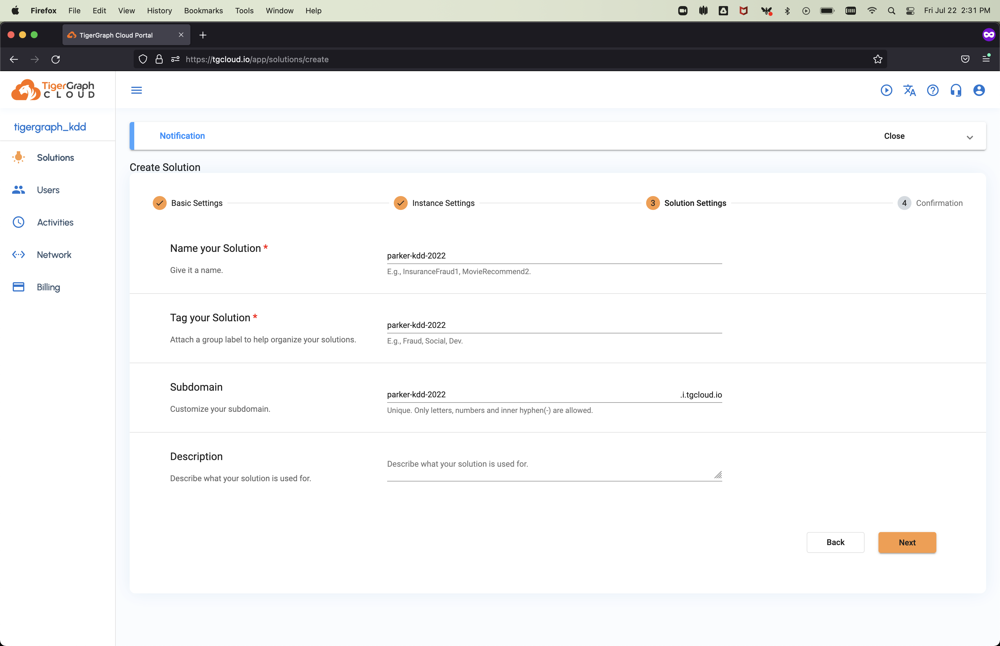
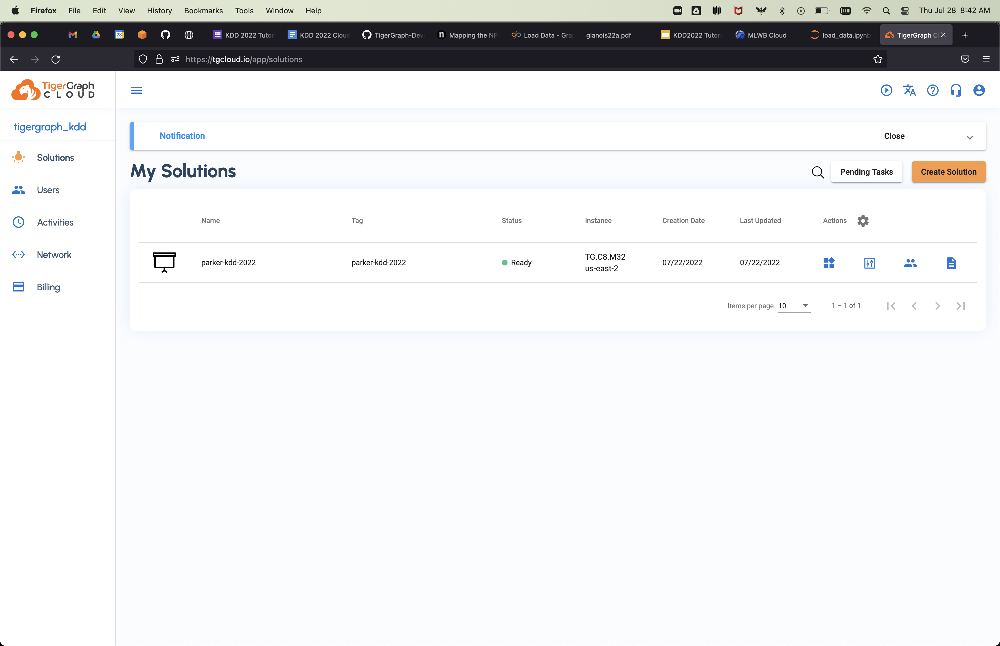
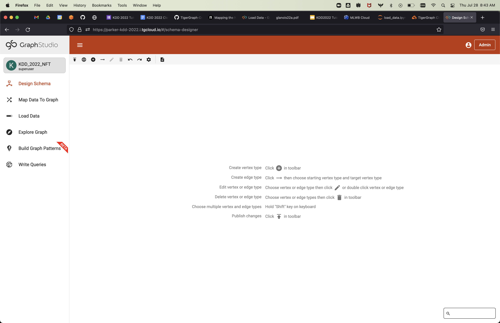
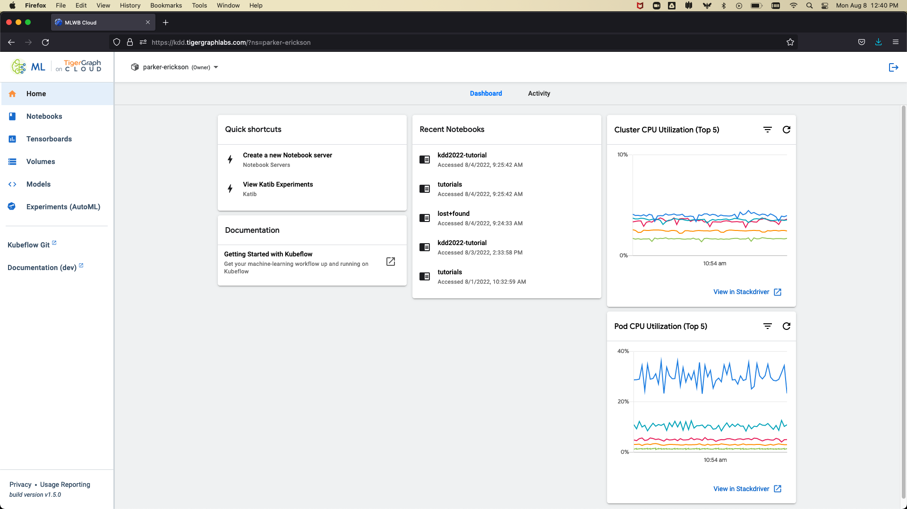
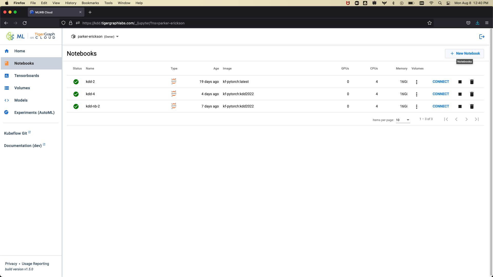
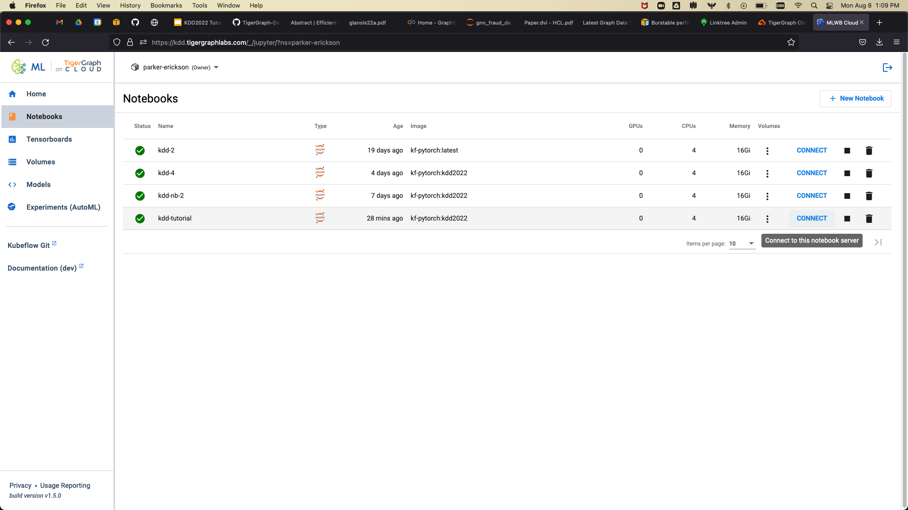

## Getting Started

### Provisioning a Database Instance

First, we will have to provision a TigerGraph Cloud instance. Once you follow the invite link in the email you recieve from the Google Form, you will see a page like the below:

Click **Create Solution** in the upper right hand corner. You will then see:

Select **Blank v3.6.1** and scroll to the bottom of the page to continue. This will then bring you to the instance configuration page.

Select **AWS** as the platform, **N. Virginia** as the region, a **Public** endpoint, and the **TG.C8.M32** Instance Type. Leave the defaults below, scroll to the bottom of the page, and click **Next**

We will then name and tag the solution we are provisioning. **The names, tags, and subdomains must be unique, so choose something that is identifiable to you**.

After clicking next, you should see a confirmation page where you can check the details and then hit **Submit**.

This will then take you back to the solutions page, where you can find your solution after a few minutes:

#### 2. Connect to GraphStudio

Once your solution is provisioned, we want to connect to the GraphStudio UI. To do this, click on the **Applications** icon and select GraphStudio.

#### 3. Create Graph

This will take you to the GraphStudio landing page, where we can create our graph. Click on the **Global View** button and select **Create a graph**:

Clicking this will bring up the following pop-up. Fill in the graph name as `KDD_2022_NFT`, and then select **Create**:

After this, you should see the following:

### Using ML Workbench
We will use the ML Workbench to perform data analysis and machine learning on the graph data. To do this, we will provision a notebook server with **4 CPU cores and 16 GB of RAM**.
To start, view the **Solutions** page on TigerGraph Cloud:

In the upper left hand corner, click on the **Tools** tab. This will bring you to the following screen:

From there, click on the **ML Workbench** button:

Once you are on the MLWB homepage, click on **Notebooks** in the left hand menu bar:

Click on the **New Notebook** button:

Name your notebook, select the **tigergraphml/kf-pytorch:kdd2022** image, and use 4 CPU cores and 16 GB of RAM. Scroll to the bottom of the page and click **Launch**:

This will take you back to the MLWB notebooks homepage. Click on **Connect** to connect to the notebook server:

This will take you to the notebook homepage, seen here:

The code for this tutorial will be in the `kdd2022-tutorial` directory. On the left hand side, click on the **Files** tab, then select the `kdd2022-tutorial` directory, and within that select `notebooks`. Click on `0-load_data.ipynb` to open the first notebook. You should see something like this:

In order to connect to your TigerGraph database, we will be using the connection tool on the left hand tab of Jupyter. Click the TigerGraph logo to see a screen similar to this:

**Note:** If you do not see any solutions, refresh the notebook page and try again.

Select your solution and click **Connect**:

Copy the code from the pop-up and paste it into the first code cell. This will create the connection to the TigerGraph database.

You will follow the same connection process for the other notebooks.